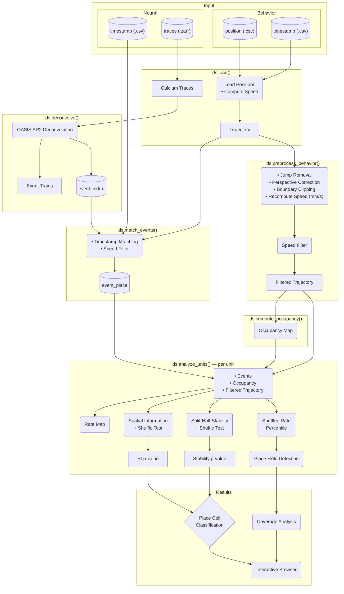

# Pipeline Details

This document explains how the spatial neural activity analysis pipeline works.

## Overview

:::{dropdown} Pipeline Flowchart

:::

## Data Files

**Neural inputs** (in `neural_path` directory):
- `{trace_name}.zarr`: calcium traces (frames × units). Name set by `trace_name` in config (e.g. `C.zarr`, `C_lp.zarr`)
- `A.zarr`: spatial footprints for cell contour overlay (optional)
- `max_proj.zarr`: max projection image for visualization background (optional)

**Behavior inputs:**
- `neural_timestamp.csv`: neural frame timestamps (frame, timestamp_first, timestamp_last)
- `behavior_position.csv`: animal position per frame (DeepLabCut format with bodypart columns)
- `behavior_timestamp.csv`: behavior frame timestamps

**Intermediate DataFrames** (generated during pipeline):
- `event_index`: deconvolved neural events (frame, unit_id, amplitude `s`)
- `event_place`: events matched to position with speed (unit_id, frame, s, x, y, speed) — only events above `speed_threshold`

## Processing Steps

### `ds.load()`

- Load calcium traces from `{trace_name}.zarr`
- Load behavior position and timestamps → compute raw speed (px/s)
- Load visualization assets (max_proj, footprints, behavior video frame)

### `ds.preprocess_behavior()`

Saves a copy of the raw trajectory in `trajectory_raw`, then applies corrections and speed filtering.

**When `arena_bounds` is configured** (full pipeline):

1. **Jump removal**: interpolate frame-to-frame displacements exceeding `jump_threshold_mm`
2. **Perspective correction**: correct for camera angle using `camera_height_mm` and `tracking_height_mm`
3. **Boundary clipping**: clip positions to `arena_bounds`
4. **Recompute speed**: recalculate speed in mm/s from corrected positions
5. **Speed filter**: apply `speed_threshold` → `trajectory_filtered`

**When `arena_bounds` is not configured** (fallback with warnings):

- Spatial corrections are skipped (jump removal, perspective correction, boundary clipping)
- Speed and position remain in pixels
- Speed filter is still applied → `trajectory_filtered`

### `ds.deconvolve()`

- Run OASIS AR2 deconvolution on each unit's calcium trace
- Parameters: `g` (AR coefficients), `baseline`, `penalty`, `s_min`
- Output: `good_unit_ids`, spike trains (`S_list`), `event_index`

### `ds.match_events()`

- For each neural event, find the closest behavior frame by timestamp
- Discard matches where timestamp difference exceeds 0.5 / `behavior_fps`
- Filter out events where animal speed was below `speed_threshold`
- Output: `event_place`

### `ds.compute_occupancy()`

- Compute 2D occupancy histogram from `trajectory_filtered`
- Smooth with `occupancy_sigma`, mask bins below `min_occupancy`
- Output: `occupancy_time`, `valid_mask`, bin edges

### `ds.analyze_units()` — per unit

Four independent computations from the same inputs (events, filtered trajectory, occupancy):

- **Rate map**: event weights / occupancy time, smoothed with `activity_sigma` (for display)
- **Spatial information + shuffle test**: Skaggs SI with circular-shift shuffle → SI p-value
- **Shuffled rate percentile**: per-bin percentile of shuffled rate maps → used for place field seed detection
- **Split-half stability + shuffle test**: correlation between first/second half rate maps with circular-shift shuffle → stability p-value

**Place cell classification**: units with SI p-value < `p_value_threshold` AND stability p-value < `p_value_threshold`.

**Place field detection** (Guo et al. 2023):
1. **Seed detection**: bins where rate exceeds the shuffled rate percentile. Only contiguous seed regions with ≥ `place_field_min_bins` bins are kept
2. **Extension**: each seed region extends to contiguous bins with rate ≥ `place_field_threshold` × (seed's peak rate)

### Results

- **Coverage map**: sum of place field masks across place cells
- **Coverage curve**: cells sorted by field size (largest first), cumulative fraction of environment covered
- **Interactive browser**: max projection overlay, trajectory with events, rate map with place field contour, SI histogram, stability maps, trace view

## Key Parameters

- `speed_threshold`: minimum speed to include data (mm/s)
- `min_occupancy`: minimum time per bin to be valid (seconds)
- `bins`: spatial resolution (number of bins per axis)
- `occupancy_sigma`: Gaussian smoothing sigma for occupancy map (in bins)
- `activity_sigma`: Gaussian smoothing sigma for rate map (in bins)
- `n_shuffles`: number of circular-shift shuffle iterations
- `min_shift_seconds`: minimum circular shift for shuffle test (seconds)
- `p_value_threshold`: p-value threshold for both SI and stability significance
- `si_weight_mode`: `"amplitude"` (event amplitudes) or `"binary"` (event counts)
- `place_field_threshold`: fraction of peak rate for place field extension
- `place_field_min_bins`: minimum contiguous bins for a place field seed
- `place_field_seed_percentile`: percentile of shuffled rates for seed detection

## Configuration Reference

### Data Paths Config

:::{dropdown} data_paths.yaml
```yaml
id: data_paths
mio_model: placecell.config.DataConfig
mio_version: 0.8.1
neural_path: path/to/neural
neural_timestamp: path/to/neural_timestamp.csv
behavior_position: path/to/behavior_position.csv
behavior_timestamp: path/to/behavior_timestamp.csv
```
:::

### Analysis Config

:::{dropdown} pcell_config.yaml
```yaml
id: pcell_config
mio_model: pcell.config.AnalysisConfig
mio_version: 0.8.1
neural:
  id: neural
  fps: 20.0
  oasis:
    id: oasis
    g: [1.60, -0.63]  # AR(2) coefficients (required, usually overridden by data config)
    baseline: p10
    penalty: 0.8  # Sparsity penalty (higher = fewer events). Default 0.
    s_min: 0  # Minimum event size threshold. Default 0.
  trace_name: C_lp

behavior:
  id: behavior
  behavior_fps: 20.0
  speed_threshold: 10.0  # mm/s
  speed_window_frames: 5
  bodypart: LED
  jump_threshold_mm: 100  # Max plausible frame-to-frame displacement (mm)
  spatial_map_2d:
    id: spatial_map_2d
    bins: 50
    min_occupancy: 0.025  # Minimum occupancy (in seconds) to include a bin
    occupancy_sigma: 3  # Gaussian smoothing (in bins) for occupancy map
    activity_sigma: 3  # Gaussian smoothing (in bins) for rate map
    n_shuffles: 1000
    random_seed: 1
    event_threshold_sigma: 0  # Sigma multiplier for event amplitude threshold
    p_value_threshold: 0.05  # P-value threshold for SI and stability
    min_shift_seconds: 20  # Minimum circular shift (seconds) for shuffle test
    si_weight_mode: amplitude  # 'amplitude' or 'binary'
    place_field_threshold: 0.35  # Fraction of peak rate for place field boundary
    place_field_min_bins: 5  # Minimum contiguous bins for a place field
    place_field_seed_percentile: 95  # Percentile of shuffled rates for seed detection
    trace_time_window: 600  # Time window (seconds) for trace display
```
:::
