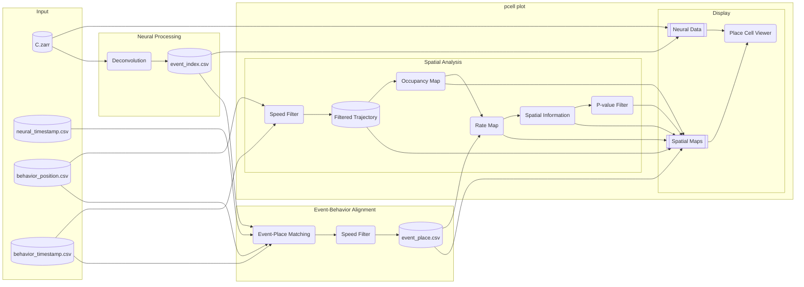

# Pipeline Details

This document explains how the spatial neural activity analysis pipeline works.

Note: This pipeline uses OASIS deconvolution to extract neural events from calcium traces. These are inferred events based on calcium dynamics, not directly recorded action potentials.

## Overview

:::{dropdown} Pipeline Flowchart

:::

## Data Files

**Input files:**
- `{trace_name}.zarr`: calcium traces (frames × units), located in `neural_path` directory with name specified by `trace_name` in config
- `neural_timestamp.csv`: neural frame timestamps
- `behavior_position.csv`: animal position (x, y per frame, with bodypart columns)
- `behavior_timestamp.csv`: behavior frame timestamps

**Intermediate files:**
- `spike_index.csv`: deconvolved neural events (frame, unit_id, amplitude)
- `spike_place.csv`: events matched to position with speed (frame, unit_id, x, y, speed) - only includes events during movement above speed threshold

## Processing Steps

### Step 1: Deconvolution

Runs `pcell deconvolve` internally:

- Load calcium traces from `neural_path`
- Apply OASIS deconvolution to extract neural events
- Output: `spike_index_{label}.csv` with frame, unit_id, amplitude

### Step 2: Event-Behavior Alignment

Runs event-place matching internally:

- Load event index from step 1
- Load behavior position and timestamps
- Compute speed from position data
- For each event, find corresponding behavior frame and position
- Filter out events that occurred when animal speed was below threshold
- Output: `spike_place_{label}.csv` with x, y, speed per event

### Step 3: Spatial Analysis and Display

Launches `pcell plot` with the processed data.

**Inputs:**
- `spike_place.csv` from step 2
- `spike_index.csv` from step 1 (optional, for trace view)
- `behavior_position.csv`, `behavior_timestamp.csv`
- `neural_path` (C.zarr, A.zarr, max_proj.zarr)

**Processing:**
- **Speed Filter**: exclude trajectory time points where speed < `speed_threshold`
- **Occupancy Map**: 2D histogram of time spent in each spatial bin
- **Rate Map**: event counts / occupancy time, smoothed with `activity_sigma`
- **Spatial Information**: bits/event using Skaggs formula with shuffle test
- **P-value Filter**: if `p_value_threshold` is set, filter to significant units

**Display:**
- Max projection with cell footprint overlay
- Trajectory with event locations (only events above speed threshold)
- Rate map (normalized event rate)
- SI histogram (actual SI vs shuffle distribution)
- Scrollable trace view at bottom

## Key Parameters

- `speed_threshold`: minimum speed to include data (filters both trajectory and events)
- `min_occupancy`: minimum time per bin to be valid
- `bins`: spatial resolution (number of bins)
- `occupancy_sigma`: Gaussian smoothing sigma for occupancy map (in bins)
- `activity_sigma`: Gaussian smoothing sigma for rate map (in bins)
- `n_shuffles`: number of shuffle iterations for p-value calculation
- `p_value_threshold`: filter units by spatial information significance

## Configuration Reference

### Data Paths Config

:::{dropdown} data_paths.yaml
```yaml
id: data_paths
mio_model: placecell.config.DataPathsConfig
mio_version: 0.8.1
neural_path: path/to/neural
neural_timestamp: path/to/neural_timestamp.csv
behavior_position: path/to/behavior_position.csv
behavior_timestamp: path/to/behavior_timestamp.csv
curation_csv: path/to/curation.csv  # optional
```
:::

### Analysis Config

:::{dropdown} pcell_config.yaml
```yaml
id: pcell_config
mio_model: placecell.config.AppConfig
mio_version: 0.8.1
neural:
  id: neural
  fps: 20.0
  oasis:
    id: oasis
    g: [1.60, -0.63]  # AR(2) coefficients, null to estimate from data
    baseline: p10
    penalty: 0  # Sparsity penalty (higher = fewer events). Default 0.
    optimize_g: 0  # Number of events to use for optimizing AR coefficients. 0 = no optimization (default).
    lambda_: null  # Regularization parameter. null = auto-determined.
    s_min: null  # Minimum event size. Positive = direct threshold, negative = calculated, 0 = auto, null = default.
  trace_name: C_lp
  max_units: null  # Max units to process. null = process all units.
behavior:
  id: behavior
  behavior_fps: 20.0
  speed_threshold: 10.0
  speed_window_frames: 5
  bodypart: LED_clean
  spatial_map:
    id: spatial_map
    bins: 50
    min_occupancy: 0.05  # Minimum occupancy (in seconds) to include a bin in spatial map
    occupancy_sigma: 3  # Gaussian smoothing (in bins) for occupancy map (0 = no smoothing)
    activity_sigma: 3  # Gaussian smoothing (in bins) for spatial activity map
    n_shuffles: 500
    random_seed: 1
    event_threshold_sigma: 0  # Sigma multiplier for event amplitude threshold in trajectory visualization
    p_value_threshold: 0.05  # P-value threshold. Only units with p < threshold are plotted.
```
:::
