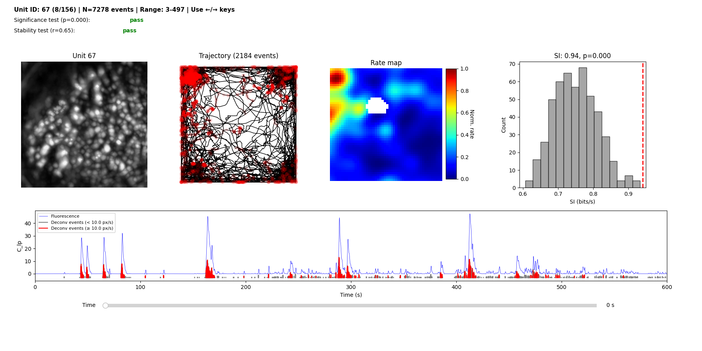

# Quickstart

Run spatial neural activity analysis with a single command:

```bash
pcell workflow visualize --config config.yaml --data data_paths.yaml
```

## Required Files

**Neural data directory** (e.g., `minian/` output):
- `{trace_name}.zarr`: calcium traces (e.g., `C.zarr` or `C_lp.zarr`)
- `A.zarr`: spatial footprints for cell overlay (optional)
- `max_proj.zarr`: max projection image for visualization (optional)

**Timestamp and position files:**
- `neural_timestamp.csv`: neural frame timestamps
- `behavior_position.csv`: animal position with bodypart columns (DeepLabCut format)
- `behavior_timestamp.csv`: behavior frame timestamps

**Configuration files:**
- `config.yaml`: analysis parameters
- `data_paths.yaml`: paths to your data files

## Setup

### 1. Create data paths config

Create `data_paths.yaml` with paths relative to this file:

:::{dropdown} data_paths.yaml
```yaml
id: your_data
mio_model: placecell.config.DataPathsConfig
mio_version: 0.8.1
# Directory containing zarr files (C.zarr, A.zarr, max_proj.zarr)
neural_path: path/to/minian_output
neural_timestamp: path/to/neural_timestamp.csv
behavior_position: path/to/behavior_position.csv
behavior_timestamp: path/to/behavior_timestamp.csv
curation_csv: path/to/curation.csv  # optional: filter units by curation
```
:::

### 2. Create analysis config

Create `config.yaml` with analysis parameters:

:::{dropdown} config.yaml
```yaml
id: your_config
mio_model: placecell.config.AppConfig
mio_version: 0.8.1
neural:
  id: neural
  fps: 20.0
  trace_name: C
  oasis:
    id: oasis
    g: [1.60, -0.63]
    baseline: p10
    penalty: 0
behavior:
  id: behavior
  behavior_fps: 20.0
  bodypart: LED
  speed_threshold: 10.0
  speed_window_frames: 5
  spatial_map:
    id: spatial_map
    bins: 50
    min_occupancy: 0.05
    occupancy_sigma: 3
    activity_sigma: 3
    n_shuffles: 500
    p_value_threshold: 0.05
```
:::

### 3. Run the workflow

```bash
pcell workflow visualize --config config.yaml --data data_paths.yaml
```

## Output

The workflow displays an occupancy preview:


Then displays the stability vs significance plot:


And finally launches the interactive place cell viewer:



## CLI Options

```bash
pcell workflow visualize --help
```

Optional arguments:
- `--out-dir`: output directory (default: `output/`)
- `--label`: label for output files (default: timestamp)
- `--start-idx`, `--end-idx`: unit index range to process

## Next Steps
- See [Pipeline Details](pipeline.md) for how the analysis works
- See [CLI Reference](cli.md) for all available commands
