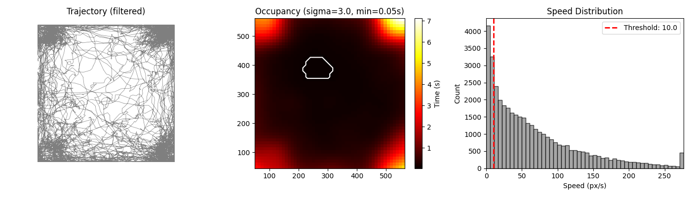
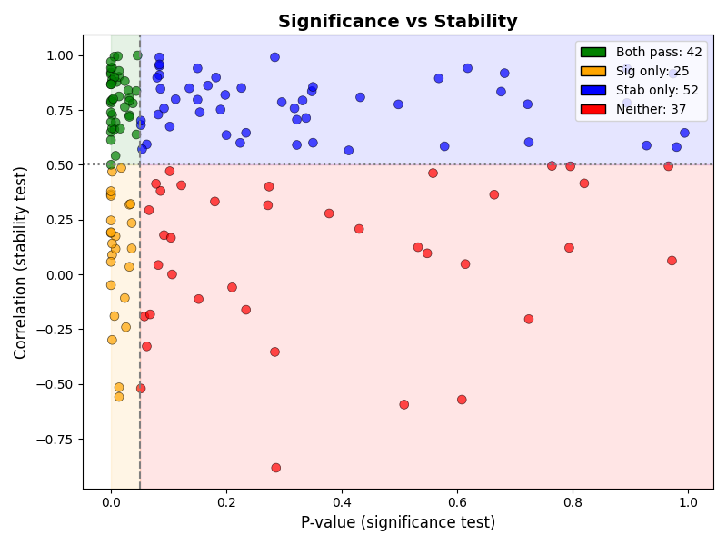
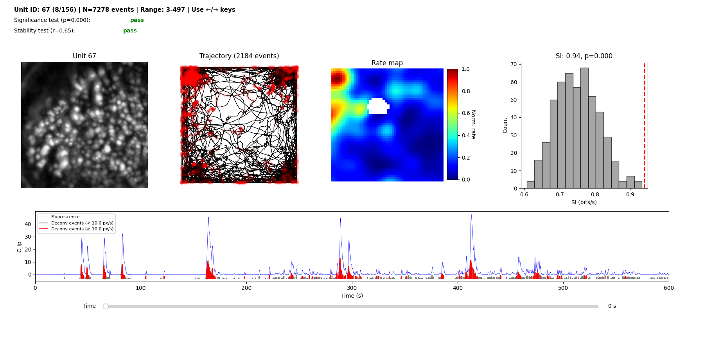

# Quickstart

`placecell` supports two workflows:

- `arena` for 2D open-field analysis
- `maze` for 1D arm/graph-based analysis

Use the notebook or Python API after preparing the right data files for your workflow.

## Required Files

**Neural data directory** (e.g., `minian/` output):
- `{trace_name}.zarr`: calcium traces (e.g., `C.zarr` or `C_lp.zarr`)
- `A.zarr`: spatial footprints for cell overlay (optional)
- `max_proj.zarr`: max projection image for visualization (optional)

**Always required:**
- `neural_timestamp.csv`: neural frame timestamps
- `behavior_timestamp.csv`: behavior frame timestamps

**Arena (2D) behavior input:**
- `behavior_position.csv`: animal position with bodypart columns (DeepLabCut format)

**Maze (1D) behavior input:**
- `behavior_position.csv`: raw DLC tracking CSV (`x`, `y`, `likelihood`)
- `behavior_graph.yaml`: zone polygons + adjacency graph
- `arm_order` in `data_paths.yaml`

**Configuration files:**
- `config.yaml`: analysis parameters
- `data_paths.yaml`: paths to your data files

## Setup

### 1. Create data paths config

Create `data_paths.yaml` with paths relative to this file:

:::{dropdown} arena data_paths.yaml
```yaml
type: arena
neural_path: path/to/minian_output
neural_timestamp: path/to/neural_timestamp.csv
behavior_position: path/to/behavior_position.csv
behavior_timestamp: path/to/behavior_timestamp.csv
behavior_fps: 20.0
bodypart: LED
```
:::

:::{dropdown} maze data_paths.yaml
```yaml
type: maze
neural_path: path/to/minian_output
neural_timestamp: path/to/neural_timestamp.csv
behavior_timestamp: path/to/behavior_timestamp.csv
behavior_position: path/to/behavior_position.csv  # raw DLC output
behavior_graph: path/to/behavior_graph.yaml      # zone polygons + adjacency
# zone_tracking: path/to/zone_tracking.csv       # optional; defaults to zone_tracking_{stem}.csv
behavior_fps: 20.0
bodypart: LED
arm_order:
  - Arm_1
  - Arm_2
  - Arm_3
  - Arm_4
```
:::

`placecell` is scorer-agnostic for DLC-style CSVs; configure the correct `bodypart`, and the scorer name is read from the file header.

### 1b. Maze: zone detection

`placecell analysis` runs zone detection automatically on first use. To drive it explicitly (e.g. to inspect the validation video, or to iterate on `zone_detection` parameters):

1. Create `behavior_graph.yaml` with `placecell define-zones -d data_paths.yaml --rooms <n> --arms <n>`.
2. Run `placecell detect-zones -d data_paths.yaml`.
3. Use `placecell analysis --force-redetect` to refresh the cached CSV after parameter changes.

### 2. Create analysis config

Create `config.yaml` with analysis parameters:

:::{dropdown} arena config.yaml
```yaml
neural:
  fps: 20.0
  trace_name: C
  oasis:
    g: [1.60, -0.63]
    baseline: p10
    penalty: 0
behavior:
  type: arena
  speed_threshold: 10.0
  speed_window_frames: 5
  spatial_map_2d:
    bins: 50
    min_occupancy: 0.05
    spatial_sigma: 3
    n_shuffles: 500
    p_value_threshold: 0.05
```
:::

:::{dropdown} maze config.yaml
```yaml
neural:
  fps: 20.0
  trace_name: C_lp
  oasis:
    g: [1.60, -0.63]
    baseline: p10
    penalty: 0.8
behavior:
  type: maze
  speed_threshold: 25
  speed_window_frames: 5
  spatial_map_1d:
    bin_width_mm: 10
    min_occupancy: 0.025
    spatial_sigma: 2
    n_shuffles: 500
    p_value_threshold: 0.05
    split_by_direction: true
    require_complete_traversal: true
```
:::

### 3. Run the analysis

For arena sessions, open `notebook/workflow_2D.ipynb` in Jupyter Lab, set `CONFIG_PATH` and `DATA_PATH`, and run all cells.

For maze sessions, use the CLI or the Python API:

```python
from placecell.dataset import BasePlaceCellDataset

ds = BasePlaceCellDataset.from_yaml("config.yaml", "data_paths.yaml")
ds.load()
ds.preprocess_behavior()
ds.deconvolve()
ds.match_events()
ds.compute_occupancy()
ds.analyze_units()
```

Or: `placecell analysis -c config.yaml -d data_paths.yaml`.

## Output

The workflow displays an occupancy preview:



Then displays the stability vs significance plot:



And finally launches the interactive place cell viewer:



## Next Steps
- See [Pipeline Details](pipeline.md) for how the analysis works
