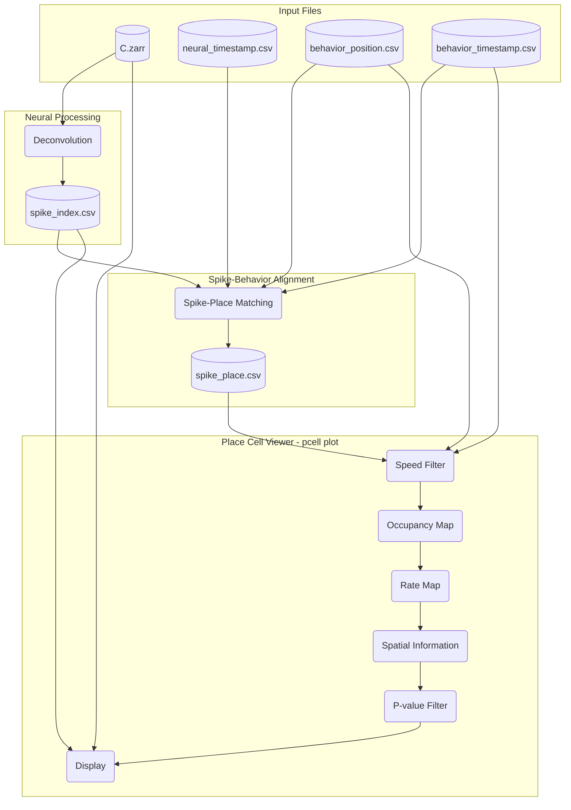
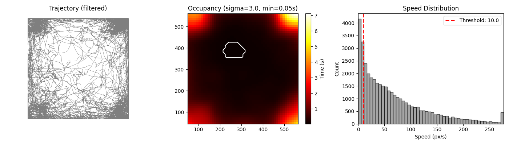
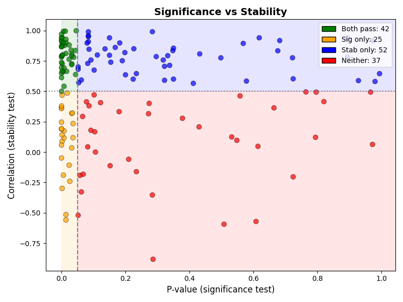

# Spatial Neural Activity Analysis

This document describes the spatial neural activity analysis workflow.
The analysis extracts deconvolved neural events, aligns them with animal position, and computes spatial tuning metrics (rate maps, spatial information).

Run the full workflow with:

```bash
pcell workflow visualize --config config.yaml --data data_paths.yaml
```

## Overview

:::{dropdown} Pipeline Flowchart

:::

## Key Parameters

- `speed_threshold`: minimum speed to include data (filters both trajectory and spikes)
- `min_occupancy`: minimum time per bin to be valid
- `bins`: spatial resolution
- `occupancy_sigma`: occupancy map smoothing
- `activity_sigma`: rate map smoothing
- `n_shuffles`: shuffle iterations for p-value
- `p_value_threshold`: filter units by spatial information significance

## Usage

```bash
pcell workflow visualize --config config.yaml --data data_paths.yaml
```

**Options:**
- `--config`: YAML config file with analysis settings (required)
- `--data`: YAML file with data paths (required)
- `--out-dir`: output directory (default: `output/`)
- `--label`: label for output files (default: timestamp)
- `--start-idx`, `--end-idx`: unit index range to process

### Data Paths Config

All fields required except `curation_csv`. Paths are relative to the YAML file location.

:::{dropdown} data_paths.yaml
```yaml
id: data_paths
mio_model: placecell.config.DataPathsConfig
mio_version: 0.8.1
neural_path: path/to/neural
neural_timestamp: path/to/neural_timestamp.csv
behavior_position: path/to/behavior_position.csv
behavior_timestamp: path/to/behavior_timestamp.csv
curation_csv: path/to/curation.csv  # optional
```
:::

### Analysis Config

:::{dropdown} pcell_config.yaml
```yaml
id: pcell_config
mio_model: placecell.config.AppConfig
mio_version: 0.8.1
neural:
  id: neural
  fps: 20.0
  oasis:
    id: oasis
    g: [1.60, -0.63]  # AR(2) coefficients, null to estimate from data
    baseline: p10
    penalty: 0  # Sparsity penalty (higher = fewer spikes). Default 0.
    optimize_g: 0  # Number of events to use for optimizing AR coefficients. 0 = no optimization (default).
    lambda_: null  # Regularization parameter. null = auto-determined.
    s_min: null  # Minimum spike size. Positive = direct threshold, negative = calculated, 0 = auto, null = default.
  trace_name: C_lp
  max_units: null  # Max units to process. null = process all units.
behavior:
  id: behavior
  behavior_fps: 20.0
  speed_threshold: 10.0
  speed_window_frames: 5
  bodypart: LED_clean
  spatial_map:
    id: spatial_map
    bins: 50
    min_occupancy: 0.05  # Minimum occupancy (in seconds) to include a bin in spatial map
    occupancy_sigma: 3  # Gaussian smoothing (in bins) for occupancy map (0 = no smoothing)
    activity_sigma: 3  # Gaussian smoothing (in bins) for spatial activity map
    n_shuffles: 500
    random_seed: 1
    spike_threshold_sigma: 0  # Sigma multiplier for spike amplitude threshold in trajectory visualization
    p_value_threshold: 0.05  # P-value threshold. Only units with p < threshold are plotted.
```
:::

## Output

The workflow first displays the occupancy preview:



Then launches the interactive place cell viewer:



## Processing steps

### Step 1: Deconvolve neural activity

Runs `pcell deconvolve` internally:

- Load calcium traces from `neural_path` (example: `C.zarr`)
- Apply OASIS deconvolution to extract spike events
- Output: `spike_index_{label}.csv` with frame, unit_id, amplitude

### Step 2: Neural event-behavior alignment

Runs event-place matching internally:

- Load spike index from step 1
- Load behavior position and timestamps
- Compute speed from position data
- For each spike, find corresponding behavior frame and position
- Add speed at each spike time
- Output: `spike_place_{label}.csv` with x, y, speed per spike

### Step 3: Place Cell Viewer

Launches `pcell plot` with the processed data.

**Inputs:**
- `spike_place.csv` from step 2
- `spike_index.csv` from step 1 (optional, for trace view)
- `behavior_position.csv`, `behavior_timestamp.csv`
- `neural_path` (C.zarr, A.zarr, max_proj.zarr)

**Processing:**
- **Speed Filter**: exclude time points where speed < `speed_threshold`
- **Occupancy Map**: 2D histogram of time spent in each spatial bin
- **Rate Map**: spike counts / occupancy time, smoothed with `activity_sigma`
- **Spatial Information**: bits/spike using Skaggs formula with shuffle test
- **P-value Filter**: if `p_value_threshold` is set, filter to significant units

**Display:**
- Max projection with cell footprint overlay
- Trajectory with spike locations (only spikes above speed threshold)
- Rate map (normalized firing rate)
- SI histogram (actual SI vs shuffle distribution)
- Scrollable trace view at bottom

