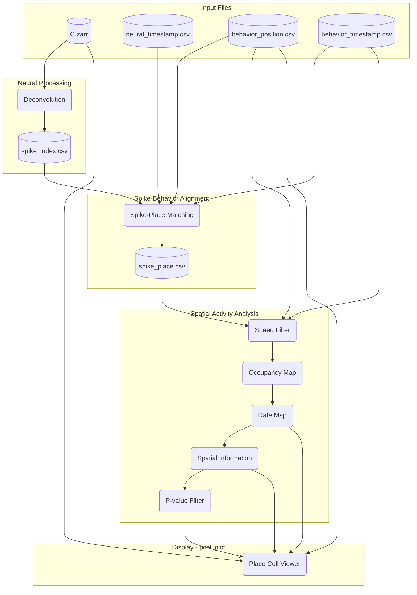

# Visualization Workflow

Order of operations in the `pcell workflow visualize` command.

## Overview

## Step-by-Step

### Step 1: Neural Processing

Runs `pcell deconvolve` internally:

- Load calcium traces from `neural_path` (C.zarr)
- Apply OASIS deconvolution to extract spike events
- Output: `spike_index_{label}.csv` with frame, unit_id, amplitude

### Step 2: Spike-Behavior Alignment

Runs spike-place matching internally:

- Load spike index from step 1
- Load behavior position and timestamps
- Compute speed from position data
- For each spike, find corresponding behavior frame and position
- Add speed at each spike time
- Output: `spike_place_{label}.csv` with x, y, speed per spike

### Step 3: Spatial Activity Analysis

Computes spatial tuning metrics:

- **Speed Filter**: exclude time points where speed < `speed_threshold` (applied before occupancy calculation)
- **Occupancy Map**: 2D histogram of time spent in each spatial bin (only includes moving periods)
- **Rate Map**: spike counts / occupancy time, smoothed with `activity_sigma`
- **Spatial Information**: bits/spike using Skaggs formula with shuffle test
- **P-value Filter**: if `p_value_threshold` is set, filter to significant units

### Step 4: Place Cell Viewer

Launches `pcell plot` with the processed data:

- Max projection with cell footprint overlay (from C.zarr)
- Trajectory with spike locations (from behavior_position.csv)
- Rate map (normalized firing rate)
- SI histogram (actual SI vs shuffle distribution)
- Scrollable trace view at bottom

## Key Parameters

- `speed_threshold`: minimum speed to include data (filters both trajectory and spikes)
- `min_occupancy`: minimum time per bin to be valid
- `bins`: spatial resolution
- `occupancy_sigma`: occupancy map smoothing
- `activity_sigma`: rate map smoothing
- `n_shuffles`: shuffle iterations for p-value
- `p_value_threshold`: filter units by spatial information significance
